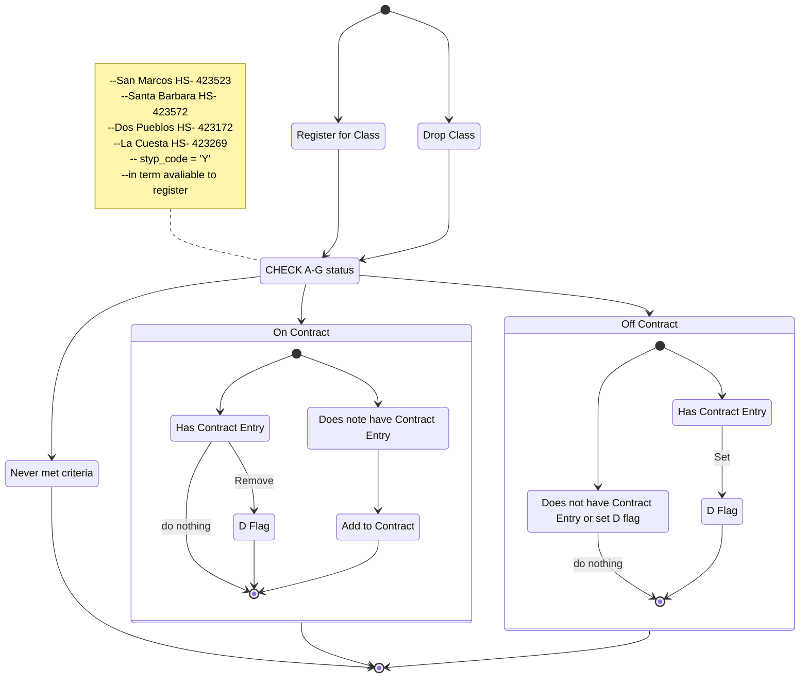

# A-G Grant

Package to automate putting students on A-G Grant in Banner

```mermaid
stateDiagram-v2
    Reg: Register for Class
    Drop: Drop Class
    Check: CHECK A-G status
    On: On Contract
    Off: Off Contract
    Add: Add to Contract
    hasentry1: Has Contract Entry
    noentry1: Does note have Contract Entry
    hasentry2: Has Contract Entry
    noentry2: Does not have Contract Entry or set D flag
    dnmc: Never met criteria
    dflag1: D Flag
    dflag2: D Flag
    note left of Check
        --San Marcos HS- 423523
        --Santa Barbara HS- 423572
        --Dos Pueblos HS- 423172
        --La Cuesta HS- 423269
        -- styp_code = 'Y'
        --in term avaliable to register
    end note
    [*] --> Drop
    [*] --> Reg
    Reg --> Check
    Drop --> Check
    
    Check --> On
    Check --> Off
    State On {
        [*] --> hasentry1
        [*] --> noentry1
         hasentry1 --> [*]: do nothing
         hasentry1 --> dflag1: Remove
         dflag1 --> [*]
    noentry1 --> Add 
    Add --> [*]
     }
    State Off{
        [*] --> hasentry2
        [*] --> noentry2
       hasentry2 --> dflag2: Set
       noentry2 --> [*]: do nothing 
       dflag2 --> [*]
    }
     Check --> dnmc
     dnmc --> [*]
     On --> [*]
    Off --> [*]
    


    
```
